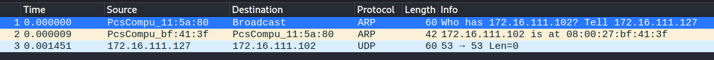

# 基于 Scapy 编写端口扫描器
## 实验目的
掌握网络扫描之端口状态探测的基本原理
## 实验环境
python + scapy
- 攻击者主机(kali-demo)
    - 172.16.111.127
- 受害者主机(kali-victim)
    - 172.16.111.102
- 网关(debian-gateway)
    - 172.16.111.1
## 实验过程
- 禁止探测互联网上的 IP ，严格遵守网络安全相关法律法规
- 完成以下扫描技术的编程实现
    - TCP connect scan / TCP stealth scan
        - TCP connect scan
        - 
        - ps.将.py文件拖到虚拟机：设备——共享粘贴板——双向；拖放——双向
        ```py
        from scapy.all import *
        def tcpconnect(dst_ip, dst_port, timeout=10):
            pkts = sr1(IP(dst=dst_ip)/TCP(dport=dst_port,flags="S"),timeout=timeout)
            # 无响应意味着目标主机的端口处于过滤状态
            if pkts is None:
                print("Filtered")
            elif(pkts.haslayer(TCP)):
                # 0x012:(SYN,ACK)包证明端口开放
                if(pkts.getlayer(TCP).flags == 0x12):
                    #发送ACK确认包
                    send_rst = sr(IP(dst=dst_ip)/TCP(dport=dst_port,flags="AR"),timeout=timeout)
                    print("Open")
                # 0x014:(RST,ACK)包证明端口关闭
                elif (pkts.getlayer(TCP).flags == 0x14):   
                    print("Closed")
        # 连接靶机
        tcpconnect('172.16.111.102', 80)
        ```
        - 开放状态
        ```
        sudo tcpdump -i eth0 -enp -w 20211010.1.pcap #抓包
        sudo python3 tcp.py #执行代码
        # 停止抓包
        ```
        
        
        - 关闭状态
        ```
        sudo tcpdump -i eth0 -enp -w catch.pcap #抓包命令
        sudo python3 tcp.py #执行代码
        ```
        - 过滤状态
        ```
        sudo tcpdump -i eth0 -enp -w 20211010.3.pcap
        ```
        - TCP stealth scan
        ```py
        import logging
        from scapy.all import *
        logging.getLogger("scapy.runtime").setLevel(logging.ERROR)
        dst_ip = "172.16.111.102"
        src_port = RandShort()
        dst_port=80
        print('TCP stealth scan:')
        print('-----------------------------------------')
        stealth_scan_resp = sr1(IP(dst=dst_ip)/TCP(sport=src_port,dport=dst_port,flags="S"),timeout=10)
        print('-----------------------------------------')
        if(str(type(stealth_scan_resp))=="<class 'NoneType'>"):
            print('State of port '+ str(dst_port) +' on '+ str(dst_ip) +": Filtered")
        elif(stealth_scan_resp.haslayer(TCP)):
            if(stealth_scan_resp.getlayer(TCP).flags == 0x12):
                send_rst = sr(IP(dst=dst_ip)/TCP(sport=src_port,dport=dst_port,flags="R"),timeout=10)
                print('State of port '+ str(dst_port) +' on '+ str(dst_ip) +": Open")
            elif (stealth_scan_resp.getlayer(TCP).flags == 0x14):
                print('State of port '+ str(dst_port) +' on '+ str(dst_ip) +": Closed")
        elif(stealth_scan_resp.haslayer(ICMP)):
            if(int(stealth_scan_resp.getlayer(ICMP).type)==3 and int(stealth_scan_resp.getlayer(ICMP).code) in [1,2,3,9,10,13]):
                print('State of port '+ str(dst_port) +' on '+ str(dst_ip) +": Filtered")
        ```
        - 开放状态
        ```
        sudo tcpdump -i eth0 -enp -w 20211010.4.pcap #抓包
        sudo python3 stealth.py #执行代码
        ```
        - 关闭状态
        ```
        sudo tcpdump -i eth0 -enp -w 20211010.5.pcap #抓包命令
        sudo python3 stealth.py #执行代码
        ```
        - 过滤状态
        ```
        sudo tcpdump -i eth0 -enp -w 20211010.6.pcap
        ```
    - TCP Xmas scan / TCP fin scan / TCP null scan
        - TCP Xmas scan
        - 
        ```py
        from scapy.all import *
        def Xmasscan(dst_ip, dst_port, timeout=10):
            pkts = sr1(IP(dst=dst_ip)/TCP(dport=dst_port, flags="FPU"), timeout=10)
            if (pkts is None):
                print("Open or Filtered")
            elif(pkts.haslayer(TCP)):
                if(pkts.getlayer(TCP).flags == 0x14):
                    print("Closed")
            elif(pkts.haslayer(ICMP)):
                if(int(pkts.getlayer(ICMP).type) == 3 and int(pkts.getlayer(ICMP).code) in [1, 2, 3, 9, 10, 13]):
                    print("Filtered")
        Xmasscan('172.16.111.102', 80)
        ```
        - 开放状态
        ```
        sudo tcpdump -i eth0 -enp -w 20211010.7.pcap #抓包
        sudo python3 Xmas.py #执行代码
        ```
        - 关闭状态
        ```
        sudo tcpdump -i eth0 -enp -w 20211010.8.pcap #抓包命令
        sudo python3 Xmas.py #执行代码
        ```
        - 过滤状态
        ```
        sudo tcpdump -i eth0 -enp -w 20211010.9.pcap
        ```
        - TCP fin scan
        - 
        ```py
        from scapy.all import *
        def finscan(dst_ip, dst_port, timeout=10):
            pkts = sr1(IP(dst=dst_ip)/TCP(dport=dst_port, flags="F"), timeout=10)
            if (pkts is None):
                print("Open|Filtered")
            elif(pkts.haslayer(TCP)):
                if(pkts.getlayer(TCP).flags == 0x14):
                    print("Closed")
            elif(pkts.haslayer(ICMP)):
                if(int(pkts.getlayer(ICMP).type) == 3 and int(pkts.getlayer(ICMP).code) in [1, 2, 3, 9, 10, 13]):
                    print("Filtered")
        finscan('172.16.111.102', 80)
        ```
        - 开放状态
        ```
        sudo tcpdump -i eth0 -enp -w 20211010.10.pcap #抓包
        sudo python3 fin.py #执行代码
        ```
        - 关闭状态
        ```
        sudo tcpdump -i eth0 -enp -w 20211010.11.pcap #抓包命令
        sudo python3 fin.py #执行代码
        ```
        - 过滤状态
        ```
        sudo tcpdump -i eth0 -enp -w 20211010.12.pcap
        ```
        - TCP null scan
        - 
        ```py
        from scapy.all import *
        def nullscan(dst_ip, dst_port, timeout=10):
            pkts = sr1(IP(dst=dst_ip)/TCP(dport=dst_port, flags=""), timeout=10)
            if (pkts is None):
                print("Open|Filtered")
            elif(pkts.haslayer(TCP)):
                if(pkts.getlayer(TCP).flags == 0x14):
                    print("Closed")
            elif(pkts.haslayer(ICMP)):
                if(int(pkts.getlayer(ICMP).type) == 3 and int(pkts.getlayer(ICMP).code) in [1, 2, 3, 9, 10, 13]):
                    print("Filtered")
        nullscan('172.16.111.102', 80)
        ```
        - 开放状态
        ```
        sudo tcpdump -i eth0 -enp -w 20211010.13.pcap #抓包
        sudo python3 null.py #执行代码
        ```
        - 关闭状态
        ```
        sudo tcpdump -i eth0 -enp -w 20211010.14.pcap #抓包命令
        sudo python3 null.py #执行代码
        ```
        - 过滤状态
        ```
        sudo tcpdump -i eth0 -enp -w 20211010.15.pcap
        ```
    - UDP scan
        - 
        ```py
        from scapy.all import *
        def udpscan(dst_ip, dst_port, dst_timeout=10):
            resp = sr1(IP(dst=dst_ip)/UDP(dport=dst_port), timeout=dst_timeout)
            if (resp is None):
                print("Open|Filtered")
            elif (resp.haslayer(UDP)):
                print("Open")
            elif(resp.haslayer(ICMP)):
                if(int(resp.getlayer(ICMP).type) == 3 and int(resp.getlayer(ICMP).code) == 3):
                    print("Closed")
                elif(int(resp.getlayer(ICMP).type) == 3 and int(resp.getlayer(ICMP).code) in [1, 2, 9, 10, 13]):
                    print("Filtered")
                elif(resp.haslayer(IP) and resp.getlayer(IP).proto == IP_PROTOS.udp):
                    print("Open")
        udpscan('172.16.111.102', 53)
        ```
        - 开放状态
        ```
        sudo tcpdump -i eth0 -enp -w 20211010.16.pcap #抓包
        sudo python3 udp.py #执行代码
        ```
        - 关闭状态
        ```
        sudo tcpdump -i eth0 -enp -w 20211010.17.pcap #抓包命令
        sudo python3 udp.py #执行代码
        ```
        - 过滤状态
        ```
        sudo tcpdump -i eth0 -enp -w 20211010.18.pcap
        ```
- 上述每种扫描技术的实现测试均需要测试端口状态为：开放、关闭 和 过滤 状态时的程序执行结果
    ```
    sudo apt-get update 
    sudo apt install ufw #靶机
    sudo apt-get install dnsmasq 
    ```
    - 开放状态
    ```
    systemctl start apache2 #开启80端口
    systemctl start dnsmasq #开启53端口
    ```
    - 关闭状态
    ```
    ufw disable #关闭防火墙
    systemctl stop apache2 #关闭端口80
    systemctl stop dnsmasq #关闭端口53
    ```
    
    - 过滤状态
    ```
    ufw enable #开启防火墙
    ufw enable && ufw deny 80/tcp #开启80端口
    ufw enable && ufw deny 53/udp #开启53端口
    ```
    
- 提供每一次扫描测试的抓包结果并分析与课本中的扫描方法原理是否相符？如果不同，试分析原因；
    - TCP connect scan
        - 开放状态
        - 
        - 关闭状态
        - 
        - 过滤状态
        - 
    - TCP stealth scan
        - 开放状态
        - 
        - 关闭状态
        - 
        - 过滤状态
        - 
    - TCP Xmas scan
        - 开放状态
        - 
        - 关闭状态
        - 
        - 过滤状态
        - 
    - TCP fin scan
        - 开放状态
        - 
        - 关闭状态
        - 
        - 过滤状态
        - 
    - TCP null scan
        - 开放状态
        - 
        - 关闭状态
        - 
        - 过滤状态
        - 
    - UDP scan
        - 开放状态
        - 
        - 关闭状态
        - 
        - 过滤状态
        - 
- （可选）复刻 nmap 的上述扫描技术实现的命令行参数开关
    - TCP connect scan  
        `nmap -sT -p 80 172.16.111.102`
        - 开放状态
        
        - 关闭状态
        
        - 过滤状态
        
    - TCP stealth scan      
        `sudo nmap -sS -p 80 172.16.111.102 `
        - 开放状态
        - 
        - 关闭状态
        - 
        - 过滤状态
        - 
    - TCP Xmas scan
        `sudo nmap -sX -p 80 172.16.111.102`
        - 开放状态
        - 
        - 关闭状态
        - 
        - 过滤状态
        - 
    - TCP fin scan
        `sudo nmap -sF -p 80 172.16.111.102`
        - 开放状态
        - 
        - 关闭状态
        - 
        - 过滤状态
        - 
    - TCP null scan
        `sudo nmap -sN -p 80 172.16.111.102`
        - 开放状态
        - 
        - 关闭状态
        - 
        - 过滤状态
        - 
    - UDP scan
        - 开放状态
        - 
        - 关闭状态
        - 
        - 过滤状态
        - 