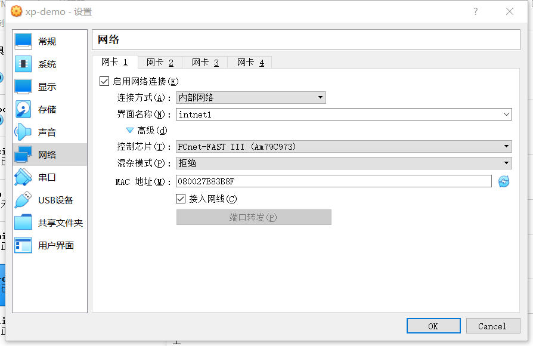

# 基于 VirtualBox 的网络攻防基础环境搭建
## 实验目的
- 掌握 VirtualBox 虚拟机的安装与使用；
- 掌握 VirtualBox 的虚拟网络类型和按需配置；
- 掌握 VirtualBox 的虚拟硬盘多重加载；
## 实验环境
以下是本次实验需要使用的网络节点说明和主要软件举例：
- VirtualBox 虚拟机
- 攻击者主机（Attacker）：Kali Rolling 2109.2
- 网关（Gateway, GW）：Debian Buster
- 靶机（Victim）：From Sqli to shell / xp-sp3 / Kali
## 实验要求
1. 虚拟硬盘配置成多重加载，效果如下图所示；(其余类似)
    
2. 按要求搭建虚拟机网络拓扑
    - 总共需新建6个虚拟机
    - 新建攻击者主机attacker-kali，更改网络为nat网络，此时attacker-kali的IP地址为10.0.2.15
    - 配置Debian网卡
        -  
        - 此时intnet1地址为172.16.111.1；intnet2地址为172.16.222.1
    - Debian-victim界面名称选择intnet2，此时Debian-victim地址为172.16.222.101
    - 配置xp-demo网卡(xp-demo2同理界面名称选择intnet2)
    
    - 配置kali-demo网卡
        - 
        - 此时kali-demo的IP地址为172.16.111.127
    - xp-demo配置tcp/ip协议分配地址(xp-demo2同理)
        - 
        - 此时xp-demo的IP地址为172.16.111.101；xp-demo2的IP地址为172.16.222.101
    - 验证连通性(网络层icmp协议是否可达)单方向连通
    
    - xp防火墙开启时 Debian无法ping通；关闭防火墙则可ping通（防火墙：起到额外的网络控制）
    - 此时可初步验证xp到网关最近的路通
    - Debian安装dnsmasq     
    `apt update && apt install dnsmasq`
    - Debian添加配置文件,提高可读性(enp0s10同理)
    
        ```
        interface=enp0s10
        dhcp-range=172.16.222.100,172.16.222.150,240h
        ```
3. 完成网络连通性测试
- [x] 靶机可以直接访问攻击者主机
    - xp-demo直接ping攻击者，可ping通
    
    - kali-demo直接ping攻击者，可ping通
    
    - xp-demo2直接ping攻击者，可ping通
    
    - debian直接ping攻击者，可ping通
    
- [x] 攻击者主机无法直接访问靶机
    
- [x] 网关可以直接访问攻击者主机和靶机
    
- [x] 靶机的所有对外上下行流量必须经过网关
    - Debian网关上安装tmux\tcpdump  
    ```
    apt update && apt install tmux
    apt install tcpdump
    tcpdump -i enp0s10 -n -w 202109.1.pcap #抓包
    ```
    
- [x] 所有节点均可以访问互联网
    - debian
    - xp-demo
    - xp-demo2
    - debian-victim
    - kali-demo
    - attacker-kali
## 跟视频
- 将xp改成自动获取

- xp上反向验证连通性，可以连通

- 目前为止有三台虚拟机，kali和xp在同一片内网，在不增加机器的情况下更改网段。xp分到一个新的ip地址

- 将Debian网卡1改为nat网络,为了使靶机回连到攻击者网络

- Debian重启网关    
`ifdown enp0s3 && ifup enp0s3`
## 问题
- ssh登录时提示「permission denied please try again」   
解决办法：使用`sudo vi /etc/ssh/sshd_config `打开该文件，找到`#PermitRootLogin `这一行，修改为 `PermitRootLogin yes`。然后使用`service sshd restart `重启sshd服务器 
## 参考资料
- [Virtualbox 多重加载 高级功能介绍_Jeanphorn的专栏-CSDN博客_virtualbox多重加载 ](https://blog.csdn.net/jeanphorn/article/details/45056251)
- [Virtualbox网络连接方式选择NAT网络，无法指定界面名称的解决方法_茄子的博客-CSDN博客_未指定nat网络名称]( https://blog.csdn.net/hexf9632/article/details/110197530)