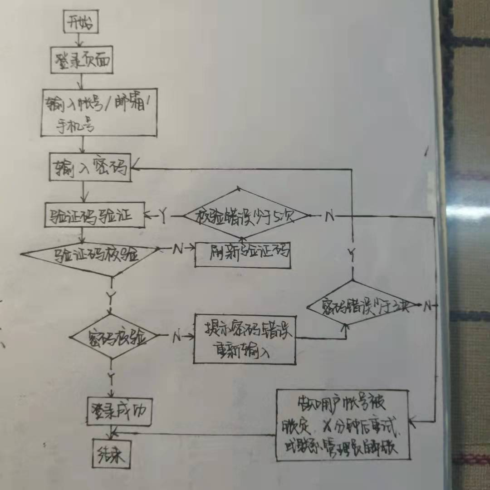
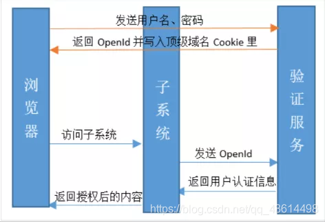

# 操作系统的访问控制设计实例研究
## 实验环境
- 操作系统版本：Android 9
- 硬件设备型号：JKM-AL00b
- 版本号：9.1.0.240（C00E235R2P3)
- 是否默认设置：是
## 以 iOS 和 Android 系统为研究对象
- 当系统处于锁屏状态下接收到新短信时，不解锁情况下
    - 系统是否允许查看短信内容？
        - 是
    - 系统是否允许回复短信？
        - 否
- 当系统处于锁屏状态下，使用系统内置（例如 iOS 的 Siri ）或第三方的语音助手可以完成以下哪些操作？
    - 访问通讯录
        - 不能
    - 拨打电话
        - 能
    - 访问相册
        - 不能
    - 查看短信收件箱
        - 不能
- 如果你的手机支持指纹识别解锁手机，请实验并分析指纹识别相比较于简单密码、复杂密码、图形解锁、人脸识别解锁、声纹解锁等解锁方式的安全性、便利性差异。
    - 指纹识别：快速解锁，应用方便；适应能力强；误判率和拒真率低；稳定性和可靠性强；易操作；可持续的发展性；指纹唯一不重复  
    - 简单密码：可被分析破解或者统计破解；便于记忆  
    - 复杂密码：增大破解难度；越多的组合提供了更多的可能性；输入较为麻烦不便于记忆  
    - 图形解锁：有可能被穷举分析    
    - 人脸识别解锁：方便高效；避免接触；由于人脸脸部存在相似性，不同个体的区别不大，所有人脸的结构都相似。再加上现代妆容技术的发展，人脸识别还是有很大的识别难度。  
    - 声纹解锁：声音具有易变性；会有环境影响；获取语音的识别成本低廉；适合远程身份确认；算法复杂度低；容易伪造
## 思考题
- 以上设计实现方式属于我们课堂上讲过的哪种强制访问控制模型？Lattice/BLP？Biba？     
    - Biba模型
- 系统或第三方应用程序是否提供了上述功能的访问控制规则修改？如果修改默认配置，是提高了安全性还是降低了安全性？  
    - 是；降低了安全性
## 课后题
- 生物特征身份认证方式有哪些？优缺点分析？应用场景举例。    
    - 指纹识别：较为成熟且价格便宜；指纹识别都是唯一的；手指若有丝毫破损或干湿环境里、沾有异物则指纹识别功能则要失效。应用：门禁、考勤系统；笔记本电脑、手机、汽车、银行支付都可应用指纹识别的技术。    
    - 人脸识别:方便高效；避免接触；由于人脸脸部存在相似性，不同个体的区别不大，所有人脸的结构都相似。再加上现代妆容技术的发展，人脸识别还是有很大的识别难度。应用：商务场所；智能家居   
    - 虹膜识别:虹膜识别误识率和拒真率已经达到了零几率的识别水平，而虹膜识别又属于非接触式的识别，识别方便高效。虹膜是每个人特有的，具有不可复制的特性，安全等级来说是目前较高的。但是虹膜识别的应用价格也因其技术难度成正比，相比其他的识别技术，略显贵态。应用：信息安全、教育考试、司法安检、银行金融、门禁考勤   
    - 声纹识别:合远程身份确认，对环境的要求非常高，在嘈杂的环境、混合说话下声纹不易获取；人的声音也会随着年龄、身体状况、年龄、情绪等的影响而变化；不同的麦克风和信道对识别性能有影响等。应用：重点人员声纹采集和建库；侦查破案；反电信诈骗；治安防控
- “找回口令功能”和“忘记密码”在访问授权机制中的意义？请尝试设计几种安全的“找回口令功能”，详细描述找回口令的用户具体操作过程。
    - 找回密码就是让用户重置密码。
    - 重置密码的时候，要给出一个链接，让用户到网页上自己修改密码。必须有失效时间。重置密码之前，如果用户提供了错误的邮件地址，不要提示他。重置密码的时候，识别用户最好依靠邮件地址，而不是用户名。重置密码之前，最好请用户回答一些个人问题。
- 绘制用户使用用户名/口令+图片验证码方式录系统的流程图。考虑认证成功和失败两种场景，考虑授权成功和失败两种场景。
    
- Windows XP / 7 中的访问控制策略有哪些？访问控制机制有哪些？
    - 访问控制：是指的安全特性，这些安全特性控制谁能够访问操作系统资源。应用程序调用访问控制函数来设置谁能够访问特定资源或控制对由应用程序提供的资源的访问。
    - 访问控制策略：自主访问控制;强制访问控制;基于角色的访问控制
    - 访问控制机制：（身份）认证；（访问）授权；（访问）审计
- 用权限三角形模型来理解并描述下 2 种威胁模型：提权、仿冒。
    - 提高自己在服务器中的权限，主要针对网站入侵过程中，当入侵某一网站时，通过各种漏洞提升WEBSHELL权限以夺得该服务器权限。比如在windows中你本身登录的用户是guest，然后通过提权后就变成超级管理员，拥有了管理Windows的所有权限。
    - 仿冒是指用户A以用户B的身份通过了认证，之后行使了B所有的权利
- 试通过操作系统的访问控制机制来达到预防一种真实病毒的运行目的。
    - 管理员限制文件权限使得无权限用户不得更改文件
- 什么是 OAuth？
    - OAUTH协议为用户资源的授权提供了一个安全的、开放而又简易的标准。与以往的授权方式不同之处是OAUTH的授权不会使第三方触及到用户的帐号信息（如用户名与密码），即第三方无需使用用户的用户名与密码就可以申请获得该用户资源的授权，因此OAUTH是安全的。oAuth是Open Authorization的简写。
- 什么是 OpenID？
    - OpenID 是一个以用户为中心的数字身份识别框架，它具有开放、分散性。OpenID 的创建基于这样一个概念：我们可以通过 URI （又叫 URL 或网站地址）来认证一个网站的唯一身份，同理，我们也可以通过这种方式来作为用户的身份认证。
- 试用本章所学理论分析 0Auth 和 OpenID 的区别与联系。
    - OAuth关注的是authorization；而OpenID侧重的是authentication。OAuth关注的是授权；而OpenID关注的是证明
- 如何使用 OAuth 和 OpenID 相关技术实现单点登录（Single Sign On）？
    - 多个站点共用一台认证授权服务器。用户经由其中任何一个站点登录后，可以免登录访问其他所有站点。而且，各站点间可以通过该登录状态直接交互。
    - 
    - OAuth
        - 配置哪些应用可以到我们服务器中来获取认证
        - 获取授权码
        - 获取token